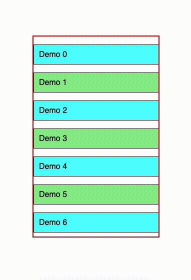

# use-draggable-scroll

React hook to add draggability to scrollable content easily.



### Installation

```
yarn add use-draggable-scroll
```
or
```
npm install use-draggable-scroll
```

### Usage

```tsx
import { useDraggableScroll } from 'use-draggable-scroll';

const Component = () => {
  const ref = useRef(null);

  const { onMouseDown } = useDraggableScroll(ref);

  return (
    <div ref={ref} onMouseDown={onMouseDown}>
      <div>child 1</div>
      <div>child 2</div>
      <div>child 3</div>
    </div>
  );
};
```

### Optional parameters

You can specify the drag direction that is allowed (`vertical`, `horizontal` or `both`(default))

```tsx
const { onMouseDown } = useDraggableScroll(ref, { direction: 'vertical' });
```
